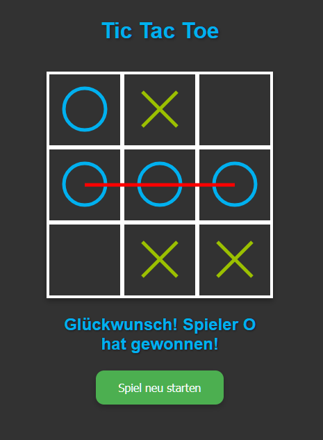

# Tic Tac Toe

> A sleek, animated Tic Tac Toe built with vanilla HTML, CSS and JavaScript — no framework, no build step.

[](https://github.com/MihaelaAghirculesei/Tic-Tac-Toe/actions/workflows/ci.yml)

**[▶ Play the live demo](https://mihaelaaghirculesei.github.io/Tic-Tac-Toe/)**

<p align="center">
  
</p>


## Features

- **Two players or vs. computer** — the computer uses minimax with alpha-beta pruning, never loses and varies its play among equally good moves
- **Choose who starts** — O or X; in computer mode X is the computer
- **Persistent scoreboard** — wins and draws per mode, kept in `localStorage` and synced across open tabs
- **Fair settings** — changing the opponent or starting player mid-game applies from the next game
- **Animated SVG marks** — X and O are drawn onto the board stroke by stroke
- **Responsive winning line** — drawn in a scalable SVG overlay, so it stays aligned on resize and rotation
- **Light and dark theme** — follows the system preference, can be toggled and is remembered
- **Accessible** — real buttons, arrow-key navigation, screen reader announcements and `prefers-reduced-motion` support
- **Confetti** on victory via [canvas-confetti](https://github.com/catdad/canvas-confetti) (optional: the game works without it)

## Tech Stack

| Layer   | Technology                                               |
| ------- | -------------------------------------------------------- |
| Markup  | HTML5 (buttons, form controls, ARIA live region)         |
| Styling | CSS custom properties, CSS Grid, keyframe animations     |
| Logic   | Vanilla JavaScript ES modules, pure game/AI logic        |
| Tooling | Node's built-in test runner, ESLint, Prettier (dev only) |
| CI/CD   | GitHub Actions, Dependabot, GitHub Pages                 |
| Effects | canvas-confetti 1.9.4 from jsDelivr, pinned with SRI     |

## Getting Started

The game uses ES modules, which browsers do not load from `file://`. Serve the folder with any static server:

```bash
git clone https://github.com/MihaelaAghirculesei/Tic-Tac-Toe.git
cd Tic-Tac-Toe
npm start            # runs "npx serve ." — or: python -m http.server
```

Then open the printed URL (e.g. http://localhost:3000).

## Development

```bash
npm install           # dev tools only (ESLint, Prettier)
npm test              # unit tests: game rules, computer player, score, keyboard navigation, theme
npm run lint
npm run format:check  # what CI runs; `npm run format` fixes it
```

Every pull request runs lint, format check and tests on GitHub Actions. Dependabot opens monthly update PRs for npm and the Actions themselves.

## Project Structure

```
index.html          markup and inline theme bootstrap
style.css           themes, layout and animations
js/
  game.js           pure game rules (no DOM) — board, moves, win/draw detection
  ai.js             unbeatable computer player (negamax + alpha-beta)
  score.js          scoreboard logic
  storage.js        safe localStorage helpers
  view.js           board rendering, winning line, keyboard navigation
  theme.js          light/dark toggle
  main.js           app controller wiring everything together
tests/              node:test unit tests
.github/            CI workflow and Dependabot configuration
```

## License

[MIT](LICENSE)
